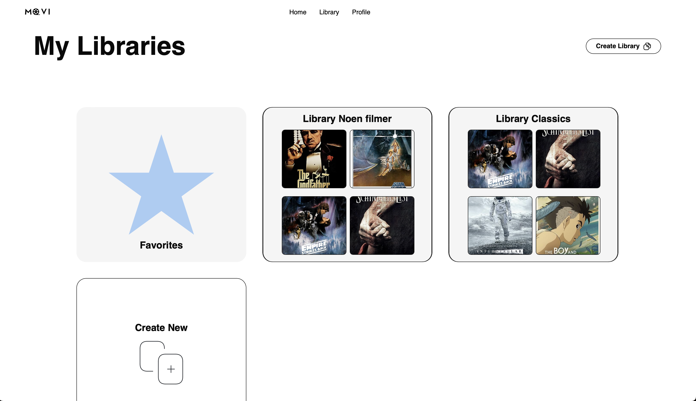
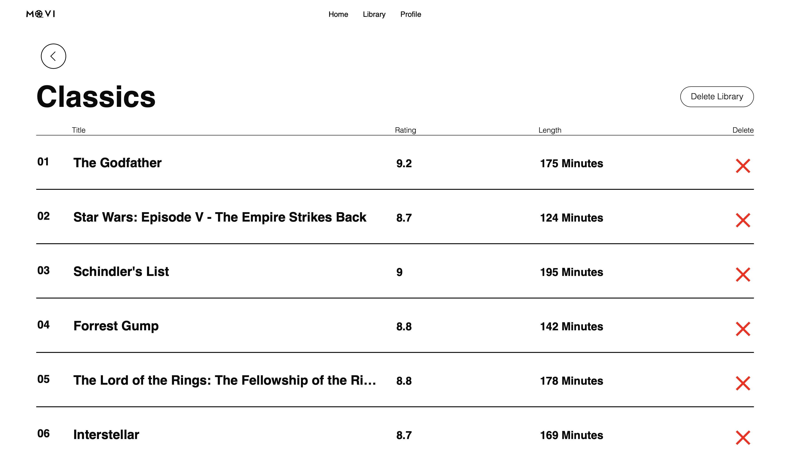

# Movi.com

This project was our product for the NTNU subject IT2810 (Web Development).

Movi.com is a movie-database website where users can browse more than 260 000 movies. Users can create an account, browse movies by searching, sorting or filtering, make custom libraries and add movies to them.
The complete feature list can be found on our detailed [wiki page](https://github.com/Jensern1/Movi.com/wiki). A guide on how to run the project can be found underneath the pictures of the website.

## Pictures from the website:


<details> 
<summary><b>📷More pictures </b></summary>






</details>

## Setup & Startup

1. **Prerequisites**:

   - Install [Node.js](https://nodejs.org/en) v20.5+ and npm v9.8+ (npm comes with Node.js installation ).
   - Ensure Vite 4.4+ is set up (Should come with Node.js also).

2. **Installation**:

   - Clone the repo:

   ```bash
   git clone https://github.com/Jensern1/Movi.com.git
   ```

   - Navigate to the project directory:

   ```bash
     cd Movi.com/
   ```

   - Install dependencies:

   ```bash
   npm run setup
   ```

All following commands should be run from the outer folder (not inside frontend or backend)

3. **Starting the Project**:

   - Run server:

   ```bash
   npm run server
   ```

   - Run client:

   ```bash
   npm run dev
   ```

4. **Testing**:

   - Run backend-tests:

   ```bash
   npm run test:backend
   ```

   - Run frontend-tests:

   ```bash
   npm run test:frontend
   ```

   - Run Cypress:

   ```bash
   npx cypress open
   ```

   , then chose E2E testing, then chose Electron. You need to be on the NTNU network or VPN to conduct the cypress tests.

5. **Code formatting**:

   - Run both linting (ESLint) and Prettier:

   ```bash
   npm run lint:fix
   ```

   - Run only linting:

   ```bash
   npm run lint
   ```

Note: If you want to test the project on mobile while running it locally, you need to navigate into interfaces.ts and modify the SERVER_URL to "http://" followed by the IP-address displayed after the "Network:"-text in the terminal and then append ":4000" at the end. Example: If the terminal contains: "Network: http://192.168.0.105:5173/", the SERVER_URL should be "http://192.168.0.105:4000".

## Contributors

<table align="center">
  <tr>
    <td align="center">
        <a href="https://github.com/Spiderpig02">
            <br />
            <sub><b>Daniel Neukirch Hansen</b></sub>
        </a>
    </td>
    <td align="center">
        <a href="https://github.com/Jensern1">
            <br />
            <sub><b>Jens Martin Norheim Berget</b></sub>
        </a>
    </td>
    <td align="center">
        <a href="https://github.com/bjorneme">
            <br />
            <sub><b>Bjørn Melaaen</b></sub>
        </a>
    </td>
  </tr>
</table>
